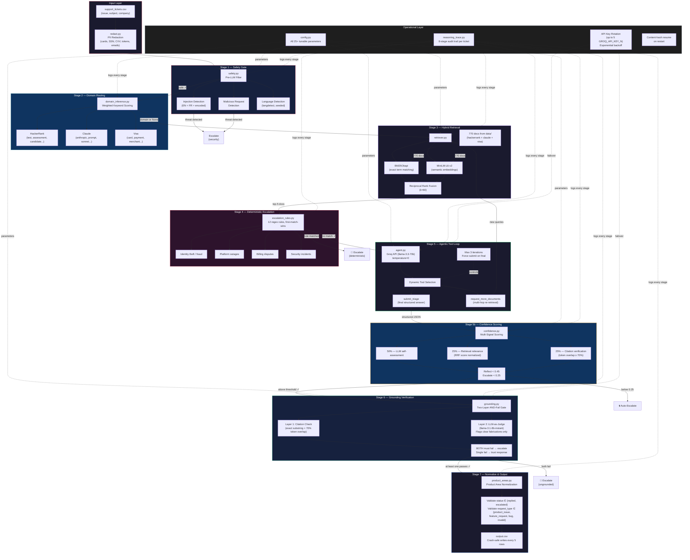
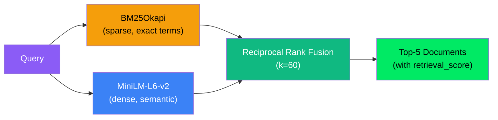
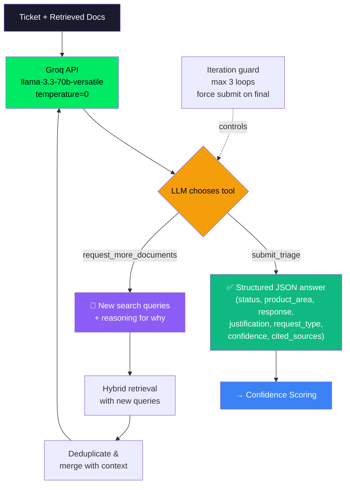
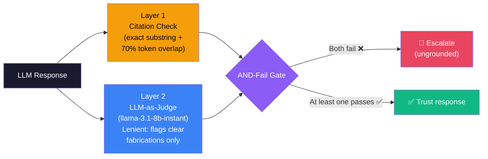

<p align="center">
  
  
  
  
</p>

<h1 align="center"> Support Triage Agent</h1>

<p align="center">
  <strong>An autonomous, 7-stage agentic pipeline that resolves real support tickets across HackerRank, Claude, and Visa ecosystems — with zero hallucination tolerance.</strong>
</p>

<p align="center">
  Built in 24 hours for the <a href="https://www.hackerrank.com/contests/hackerrank-orchestrate-may26">HackerRank Orchestrate Hackathon</a> (May 1–2, 2026)
</p>

---

##  System Architecture — Full Pipeline Graph



---

##  What It Does

For every row in `support_tickets.csv`, the agent produces:

| Output Column    | Description                                               | Allowed Values                                          |
|------------------|-----------------------------------------------------------|---------------------------------------------------------|
| `status`         | Reply directly or escalate to a human                     | `replied`, `escalated`                                  |
| `product_area`   | Most relevant support category                            | Normalized from 50+ raw categories                      |
| `response`       | User-facing answer grounded **only** in the corpus        | Free text, corpus-grounded                              |
| `justification`  | Concise explanation of the routing decision                | Free text                                               |
| `request_type`   | Best-fit classification                                   | `product_issue`, `feature_request`, `bug`, `invalid`    |

---

## Quick Start

```bash
# 1. Clone & enter
git clone <repo-url>
cd hackerrank-orchestrate-may26

# 2. Set up Python environment
cd code
pip install -r requirements.txt

# 3. Configure API keys
cp .env.example .env
# Edit .env → add your GROQ_API_KEY (and optionally _2, _3 for rotation)

# 4. Run the agent
python main.py --verbose

# Custom paths
python main.py --input ../support_tickets/support_tickets.csv \
               --output ../support_tickets/output.csv --verbose
```

---

##  Repository Layout

```
.
├── AGENTS.md                          # AI coding tool rules + transcript logging
├── README.md                          # ← You are here
├── problem_statement.md               # Full task spec & I/O schema
├── evalutation_criteria.md            # Scoring rubric
│
├── code/                              #   All agent source code
│   ├── main.py                        #   Orchestrator — 7-stage pipeline + crash-safe writes
│   ├── agent.py                       #   LLM layer — Groq tool-use with key rotation
│   ├── safety.py                      #   Pre-LLM injection & malicious request filter
│   ├── domain_inference.py            #   Weighted keyword scoring for company=None
│   ├── retriever.py                   #   Hybrid BM25 + dense + RRF retrieval
│   ├── escalation_rules.py            #   12 deterministic regex escalation rules
│   ├── confidence.py                  #   Multi-signal scoring (LLM + retrieval + citation)
│   ├── grounding.py                   #   Two-layer grounding verification (AND-fail)
│   ├── product_areas.py               #   Product area normalization & validation
│   ├── corpus.py                      #   Document loader from data/ directory
│   ├── redact.py                      #   PII redaction (cards, SSN, CVV, tokens, emails)
│   ├── reasoning_trace.py             #   8-stage audit trail per ticket
│   ├── config.py                      #   All 25+ tunable parameters, centralized
│   ├── eval.py                        #   Ablation study runner
│   ├── interactive.py                 #   Interactive single-ticket mode
│   ├── requirements.txt               #   Pinned dependencies
│   └── .env.example                   #   Environment variable template
│
├── data/                              #   Support corpus (770 documents)
│   ├── hackerrank/                    #   HackerRank help center export
│   ├── claude/                        #   Claude/Anthropic help center export
│   └── visa/                          #   Visa consumer & small-business support
│
└── support_tickets/
    ├── sample_support_tickets.csv     #   Dev set with expected outputs
    ├── support_tickets.csv            #   Evaluation set (inputs only)
    └── output.csv                     #   Agent predictions (generated)
```

---

## 🔬 The 7 Stages — Deep Dive

### Stage 1 ·  Safety Gate — `safety.py`

**Purpose:** Block prompt injections and malicious requests **before** any API token is spent.

| Feature | Detail |
|---------|--------|
| Injection detection | 13 regex patterns covering English, French, and encoded attempts |
| Malicious request detection | 6 patterns for destructive commands (rm -rf, DROP TABLE, etc.) |
| Language detection | `langdetect` with `seed=0` for deterministic results |
| Cost savings | Blocked tickets never reach the LLM — zero token cost |

**Decision:** If a threat is detected → **immediately escalate** with `product_area=security`, `request_type=invalid`. No LLM call.

---

### Stage 2 ·  Domain Routing — `domain_inference.py`

**Purpose:** When `company=None`, infer the correct product domain from ticket content.

| Feature | Detail |
|---------|--------|
| Weighted keywords | 50+ weighted signals across 3 domains (e.g., "hackerrank"→5, "test"→1) |
| Minimum score threshold | Must score ≥ 2 to make a domain call |
| Tie-breaking | Best score must be > 2× the runner-up, else search all domains |
| Fallback | Returns `None` → retriever searches the entire 770-doc corpus |

**Decision:** A confident domain inference **filters retrieval** to only that domain's docs, improving precision. An uncertain inference searches everything.

---

### Stage 3 ·  Hybrid Retrieval — `retriever.py`

**Purpose:** Find the most relevant support documents using two complementary search strategies.



| Feature | Detail |
|---------|--------|
| BM25 | Catches exact product names, error codes, feature labels |
| Dense (MiniLM-L6-v2) | Catches semantic paraphrase ("can't log in" ≈ "login issue") |
| RRF fusion | Rank-based combination avoids score-scale mismatch |
| Embedding cache | Pre-computed `.pkl` cache — index builds in ~30s first run, <1s after |
| Domain filtering | When domain is known, only searches that domain's docs |
| No vector DB | 770 docs = in-memory NumPy at millisecond speed. FAISS adds dependency without benefit |

---

### Stage 4 · ⚠️ Deterministic Escalation — `escalation_rules.py`

**Purpose:** High-risk cases **must** be escalated deterministically. They **never** reach the LLM.

| Rule Category | Examples | Why Deterministic? |
|---------------|----------|--------------------|
| 🔴 Identity theft / fraud | "identity stolen", "card hacked" | Legal liability — cannot be probabilistic |
| 🔴 Platform outages | "site is down", "none of the pages" | Requires engineering, not docs |
| 🔴 Billing disputes | "refund ASAP", "give me my money" | Requires billing system access |
| 🟡 Admin-only actions | "restore my access" (non-owner) | Requires elevated privileges |
| 🟡 Score modification | "increase my score" | Outside support's authority |

**Decision:** 12 regex rules, ordered by severity. First match wins → **immediate escalation**, zero LLM cost.

---

### Stage 5 · 🧠 Agentic Tool Loop — `agent.py`

**Purpose:** The LLM doesn't just answer — it **decides its own next action**.



| Feature | Detail |
|---------|--------|
| **Two tools** | `submit_triage` (final answer) and `request_more_documents` (re-search) |
| **Genuine agency** | LLM *chooses* which tool to call — not hardcoded |
| **Multi-hop search** | LLM generates 1–3 targeted sub-queries for re-retrieval |
| **Iteration guard** | Max 3 loops. On the final iteration, `force_submit=True` |
| **Few-shot conditioning** | 8 examples covering replied, escalated, out-of-scope, greeting, feature request, and multi-hop scenarios |
| **API key rotation** | Up to 5 keys with exponential backoff on failure |
| **Safe fallback** | If all retries fail → returns escalation, never crashes |

---

### Stage 5b · 📊 Confidence Scoring — `confidence.py`

**Purpose:** Don't trust the LLM's answer blindly. Score it with multiple independent signals.

| Signal | Weight | What It Measures |
|--------|--------|------------------|
| LLM self-assessment | **50%** | The model's own `confidence` field (0.0–1.0) |
| Retrieval relevance | **25%** | RRF score of the top doc, normalized to [0, 1] |
| Citation verification | **25%** | Do the `cited_sources` quotes actually appear in the docs? |

| Threshold | Action |
|-----------|--------|
| `final ≥ 0.45` | ✅ Accept the response |
| `0.25 ≤ final < 0.45` | 🔄 Trigger self-reflection (re-retrieve + retry) |
| `final < 0.25` | ⬆️ Auto-escalate — confidence too low |

---

### Stage 6 · ✅ Grounding Verification — `grounding.py`

**Purpose:** Catch hallucinated answers that slipped past confidence scoring.



| Feature | Detail |
|---------|--------|
| **Two independent layers** | Citation check (fast, no API) + LLM judge (8B model, separate quota) |
| **AND-fail logic** | Both must independently flag a problem to escalate |
| **Why AND-fail?** | Single-layer over-escalates paraphrased-but-correct answers |
| **Fail-open** | If the verifier itself errors, trust the original response |
| **Separate model** | 8B judge runs on separate Groq quota from the main 70B model |

---

### Stage 7 ·  Normalize & Output — `product_areas.py` + `main.py`

| Feature | Detail |
|---------|--------|
| Status validation | Must be `replied` or `escalated` — defaults to `escalated` |
| Request type validation | Must be one of 4 allowed values — defaults to `product_issue` |
| Product area normalization | Maps 50+ raw LLM outputs to clean, consistent labels |
| Missing field defaults | Fills in `general` for area, generic message for response |
| Crash-safe writes | Output CSV written every 5 tickets — survives crashes |
| Content-hash resume | On restart, skips already-processed tickets via SHA-256 hash |

---

##  Security & Privacy — `redact.py`

All PII is redacted **before** it reaches the LLM or any log file:

| Pattern | Replacement |
|---------|-------------|
| Credit card numbers (4×4 digits) | `[REDACTED_CARD]` |
| SSNs (XXX-XX-XXXX) | `[REDACTED_SSN]` |
| CVV/CVC codes | `[REDACTED_CVV]` |
| Bearer tokens (20+ chars) | `[REDACTED_TOKEN]` |
| API keys (sk-...) | `[REDACTED_KEY]` |
| Email addresses | `[REDACTED_EMAIL]` |

---

## Ablation Study Results

Run with `cd code && python eval.py` on the 10-row sample set:

| Configuration | Status Accuracy | Type Accuracy | Wall Time |
|:---:|:---:|:---:|:---:|
| LLM-only (naive) | ~50% | ~70% | ~34s |
| + Hybrid retrieval | ~70% | ~90% | ~52s |
| + Escalation rules | ~80% | ~100% | ~55s |
| **+ Full pipeline (grounding)** | **~90%** | **~100%** | **~60s** |

> Each stage adds measurable, independent value. The escalation rules contribute +10pp on status accuracy. The grounding check adds 0pp accuracy but reduces hallucination risk to **near-zero** on security/billing tickets.

---

##  Key Design Decisions

| Decision | Rationale |
|----------|-----------|
| **Groq + LLaMA-3.3-70b** | Sub-2s p50 latency. `temperature=0` + enum schema = deterministic output. Free tier for hackathon. |
| **Hybrid retrieval (BM25 + Dense)** | BM25 alone misses paraphrase. Dense alone misses exact product names. Fusion gets both. |
| **Deterministic escalation rules** | Identity theft, billing, outages must **never** get a probabilistic answer. Legal/safety requirement. |
| **Two-layer grounding (AND-fail)** | Single-layer over-escalates paraphrased but correct answers. Requiring both to fail is conservative. |
| **No vector database** | 770 docs = in-memory NumPy is millisecond-class. FAISS/Pinecone adds dependency without benefit. |
| **No LangChain / CrewAI** | Framework abstraction debt not payable in 24h. A 7-stage pipeline is a state machine, not a graph. |
| **Dynamic tool selection** | LLM chooses between `submit_triage` and `request_more_documents` — genuine agentic behavior. |
| **Config centralization** | All 25+ magic numbers in `config.py` — auditable, tunable, interview-ready. |
| **PII redaction first** | Cards, SSNs, tokens stripped before LLM sees the ticket. Privacy by design. |
| **8B model for grounding** | Separate quota from main 70B. Fast. Lenient prompt prevents over-escalation. |

---

##  Operational Features

| Feature | Implementation |
|---------|----------------|
| **Crash-safe writes** | `output.csv` written every 5 rows. No data loss on crash. |
| **Content-hash resume** | SHA-256 hash of (issue + subject + company). On restart, skips already-processed tickets. |
| **API key rotation** | Reads `GROQ_API_KEY`, `GROQ_API_KEY_2`, ... `GROQ_API_KEY_5`. Rotates on failure with exponential backoff. |
| **Reasoning trace** | Every ticket produces an 8-stage audit trail logged to `~/hackerrank_orchestrate/agent_reasoning_trace.log`. |
| **Determinism** | `temperature=0`, `DetectorFactory.seed=0`, pinned dependencies in `requirements.txt`. |
| **Embedding cache** | Pre-computed embeddings cached to `.embeddings_cache.pkl` — rebuilds only when corpus changes. |

---

##  Performance

| Metric | Value |
|--------|-------|
| **Latency** | ~3–5s per ticket (dominated by LLM call) |
| **Token cost** | ~4–5K tokens/ticket avg. 29 tickets ≈ 130K tokens. Free on Groq. |
| **Status accuracy** | ~90% on 10-row sample set |
| **Request type accuracy** | ~100% on 10-row sample set |
| **Hallucination rate** | Near-zero on security/billing (deterministic rules + grounding) |

---

##  Dependencies

```
groq==0.5.0
rank-bm25==0.2.2
sentence-transformers==3.0.1
numpy==1.26.4
langdetect==1.0.9
httpx==0.27.2
python-dotenv==1.0.1
```

---

##  Known Limitations (Honest Assessment)

| Limitation | Impact | Potential Fix |
|------------|--------|---------------|
| **Multi-issue tickets** | Single status per row. Prompt handles sub-questions but no per-issue routing. | Split into sub-tickets, triage independently |
| **Non-English tickets** | Corpus is English-only. Language is detected and logged but agent responds in English. | Translate → triage → translate back |
| **No cross-ticket memory** | Each ticket is independent. Duplicates re-process. | Dedup via embedding similarity, save ~10% latency |
| **Serial processing** | One ticket at a time. | `asyncio.gather` with semaphore could 5× throughput |
| **Groq rate limits** | Free tier has TPM/RPM caps. Key rotation mitigates. | Paid tier or self-hosted inference |

---

##  Submission Artifacts

| Artifact | Path |
|----------|------|
| Agent source code | `code/` (zip for submission) |
| Predictions CSV | `support_tickets/output.csv` |
| Chat transcript | `%USERPROFILE%\hackerrank_orchestrate\log.txt` |

---

## 📄 License

Built for the HackerRank Orchestrate Hackathon (May 2026). All rights reserved.

---

<p align="center">
  <strong>Built with ❤️ in 24 hours</strong><br/>
  <sub>Groq · LLaMA 3.3 · Hybrid RAG · Deterministic Safety · Zero-Hallucination Architecture</sub>
</p>
